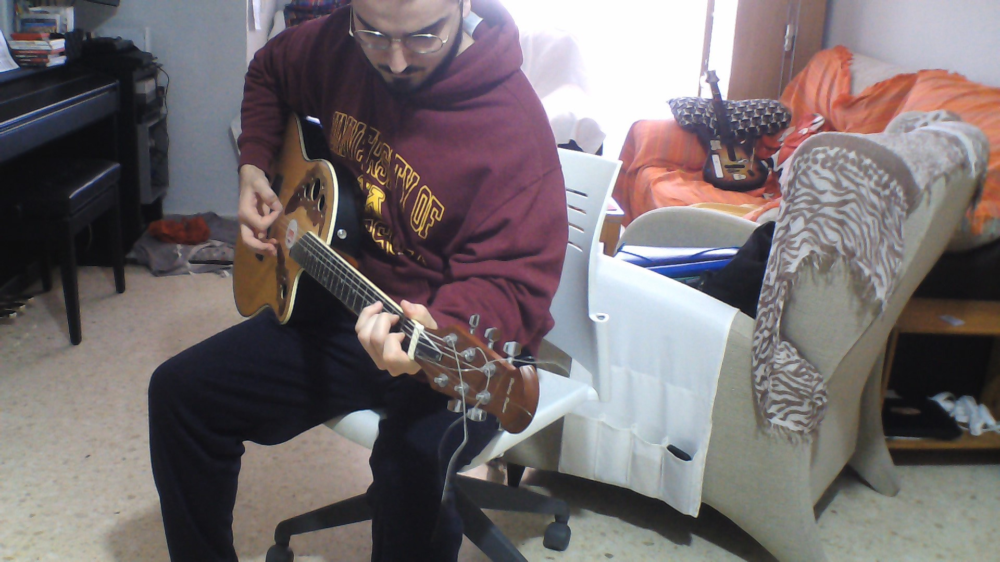
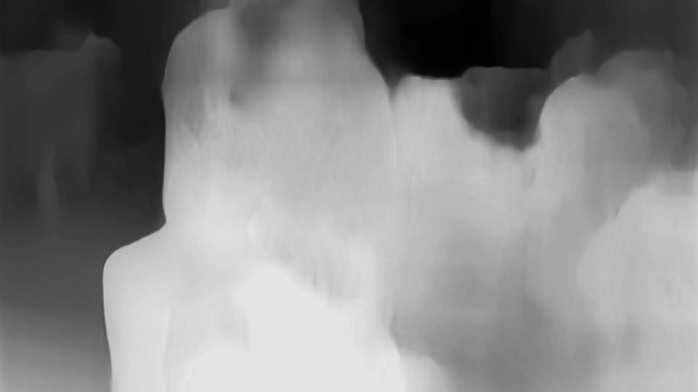

# Depth-Estimator-From-Single-Image
An inplementation of the monodepth2 model.

Not much to say here. For more information and the code go to https://github.com/nianticlabs/monodepth2 .
Clearly an excellent model that just results in incredible estimations.
The only thing I will upload is a code made by me that is a transformation of the repostery code made for detect in real time and change a couple of things...

Also, for more information about the model and the process, I've found a nice article https://heartbeat.fritz.ai/research-guide-for-depth-estimation-with-deep-learning-1a02a439b834

For what I've predicted of an image of my living room, I projected it into a scatter 3D plot. The results (knowing the outcome comes from a single image) were amazing:

**I've made a better implementation (video in the .avi and code in the new_mesh.py). Couldn't convert it to GIF... :(**

And here is one of the other tests:

